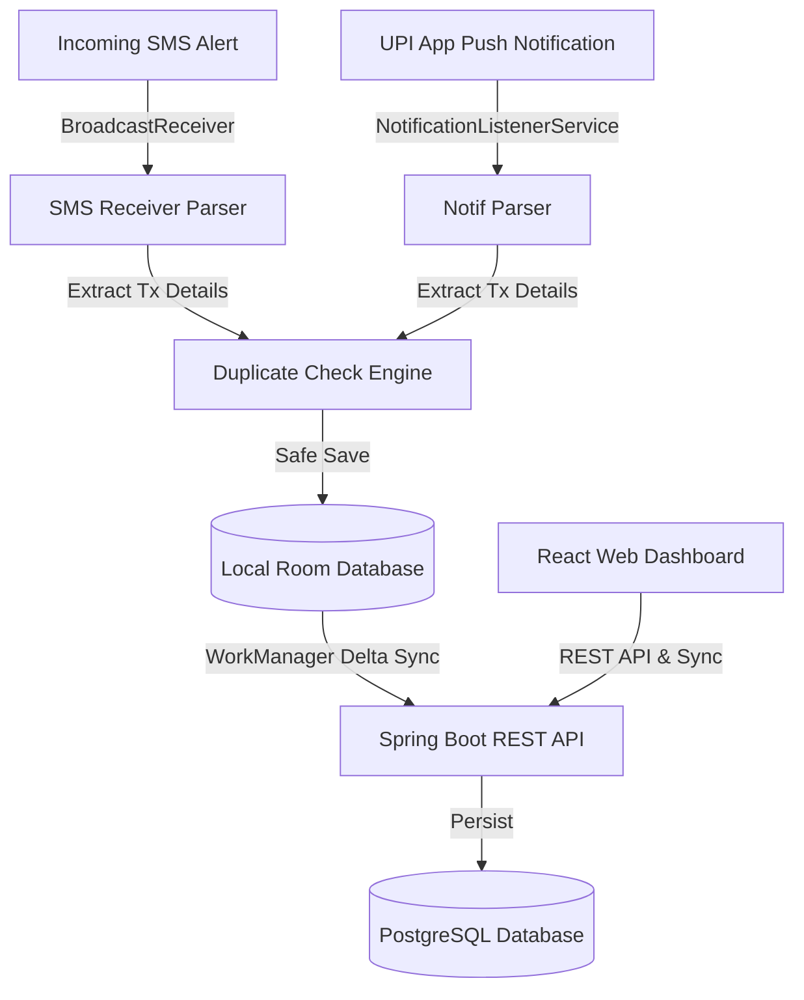

# Architecture and Design Document - Upgrade Finance

This document details the architectural layout, duplicate detection, and synchronization mechanics of **Upgrade Finance**.

---

## 🏗️ Architecture Design

---

## 🔄 Synchronisation Mechanics (Delta Sync)

Both Android and the Web Dashboard support offline-first operation. 
1. **Timestamp tracking**: Every entity tracks `updatedAt` (epoch milliseconds) and `isDeleted` (soft delete flag).
2. **Delta Sync Payload**:
   * The client posts all local records updated *after* its saved `lastSyncTimestamp`.
   * The server saves these items. If a record already exists, it uses **last-write-wins** resolution: if `client.updatedAt > server.updatedAt`, the server updates its database.
   * The server compiles a response containing all database records updated since the client's `lastSyncTimestamp` (excluding ones updated by this sync transaction).
   * The client applies these delta records to Room/local storage and saves the new server `syncTimestamp` as `lastSyncTimestamp`.

---

## 🚫 Duplicate Transaction Detection

Transactions may arrive twice: once via the payment app notification (e.g. Google Pay alert) and again via the Bank's transaction confirmation SMS.
* **Reference Number Matching**: The engine checks the unique 12-digit UPI reference number. If a transaction with the same reference number is already present in Room, the incoming SMS is discarded.
* **Heuristic Matching**: If reference numbers are missing (often true for push notifications), the app checks for any transactions in the last **2 minutes** matching the same `amount` and approximate `merchant` keyword. If a match is found, they are merged.

---

## 🤖 AI Categorisation & Financial Assistant

1. **Local Categorisation Engine**: Matches incoming merchant strings against keywords defined in `shared/default-rules.json` (e.g. Swiggy -> Food).
2. **Gemini AI Integration**: If a `GEMINI_API_KEY` is present:
   * **Categorizer**: Unknown merchants are processed by Gemini Flash to guess the correct category dynamically.
   * **Chat Assistant**: The web/mobile chat UI submits user prompts. The backend appends a summary of recent transactions to the context and sends it to Gemini to compute natural language financial summaries and savings tips.
